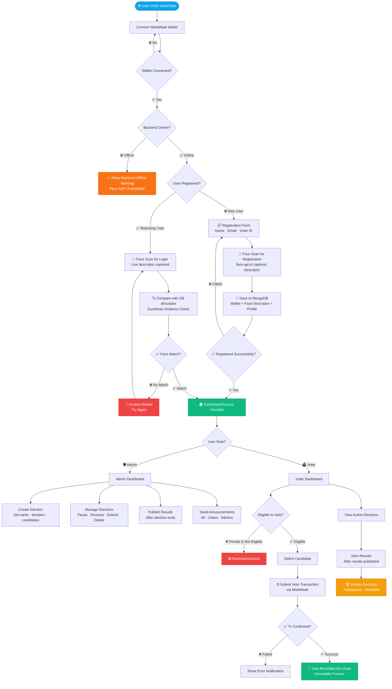
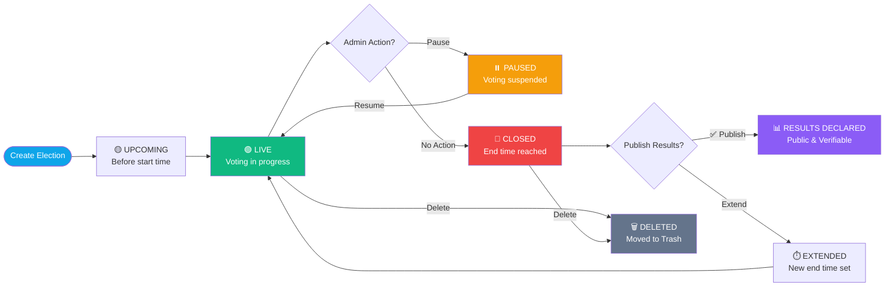
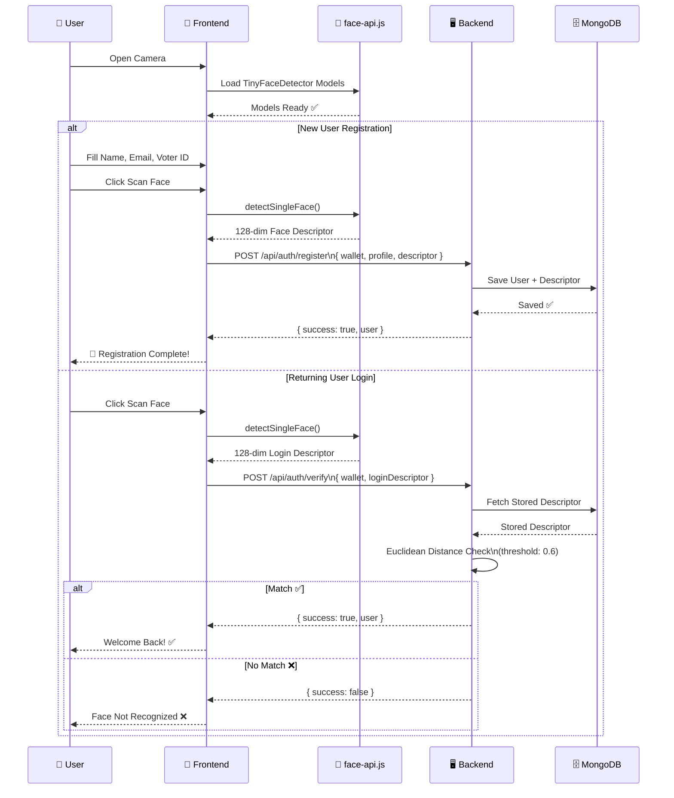

# 🗳️ VoteChain – Decentralized Voting System

<div align="center">


**A secure, transparent, and tamper-proof blockchain-based voting platform powered by Ethereum smart contracts, biometric face verification, and a modern React frontend.**

[🚀 Live Demo](#) · [📖 Documentation](#) · [🐛 Report Bug](https://github.com/lakshay-porwal/VoteChain-Hackathon-Project/issues) · [💡 Request Feature](https://github.com/lakshay-porwal/VoteChain-Hackathon-Project/issues)

</div>

---

## 📌 Table of Contents

- [About The Project](#-about-the-project)
- [System Architecture](#-system-architecture)
- [How It Works – Flowchart](#-how-it-works--flowchart)
- [Features](#-features)
- [Tech Stack](#-tech-stack)
- [Project Structure](#-project-structure)
- [Getting Started](#-getting-started)
- [Smart Contract Overview](#-smart-contract-overview)
- [Future Enhancements](#-future-enhancements)
- [Contributors](#-contributors)
- [License](#-license)

---

## 🧠 About The Project

VoteChain is a **decentralized, end-to-end verifiable voting system** built for transparency, integrity, and accessibility. Traditional voting systems suffer from risks of tampering, lack of transparency, and centralized failure points.

VoteChain solves these problems by:

- 🔗 Recording every vote **immutably on the Ethereum blockchain**
- 🧬 Verifying voter identity using **AI-powered face recognition**
- 🔐 Connecting via **MetaMask wallet** as a dual-authentication layer
- 📊 Providing real-time, **transparent results** after elections close

> Every vote is a transaction. Every result is permanent. No one can change what the blockchain has recorded.

---

## 🏗️ System Architecture

```
┌─────────────────────────────────────────────────────────┐
│                     USER BROWSER                        │
│                                                         │
│   ┌──────────────┐      ┌──────────────────────────┐   │
│   │  React + Vite│◄────►│  face-api.js (Biometric) │   │
│   │   Frontend   │      │   Face Detection / Auth  │   │
│   └──────┬───────┘      └──────────────────────────┘   │
│          │                                               │
└──────────┼───────────────────────────────────────────── ┘
           │
    ┌──────▼───────┐          ┌────────────────────┐
    │  MetaMask    │          │   Express Backend   │
    │  Wallet /    │          │   (Node.js Server)  │
    │  ethers.js   │          │                     │
    └──────┬───────┘          │  • User Registration│
           │                  │  • Face Descriptor  │
           │                  │  • MongoDB Storage  │
           │                  └────────┬────────────┘
           │                           │
    ┌──────▼───────────────────────────▼────────────┐
    │              ETHEREUM BLOCKCHAIN               │
    │                                                │
    │   ┌────────────────────────────────────────┐  │
    │   │         VoteChain Smart Contract        │  │
    │   │                                        │  │
    │   │  • createElection()                    │  │
    │   │  • vote()                              │  │
    │   │  • publishResults()                    │  │
    │   │  • pauseElection()                     │  │
    │   │  • addAnnouncement()                   │  │
    │   └────────────────────────────────────────┘  │
    └────────────────────────────────────────────────┘
```

---

## 🔄 How It Works – Flowchart

### 🔐 Complete User Journey



---

### 🗂️ Admin Election Lifecycle



---

### 🧬 Face Authentication Flow



---

## 🚀 Features

| Feature | Description |
|---|---|
| 🔐 **Dual Authentication** | MetaMask wallet + Face recognition required for access |
| ⛓️ **On-Chain Voting** | Every vote is a permanent Ethereum transaction |
| 🧾 **Immutable Records** | Smart contracts prevent any vote tampering |
| 🎭 **Role Management** | Separate Admin and Voter dashboards |
| 🔒 **Private Elections** | Whitelist-only elections for restricted access |
| ⏸️ **Pause / Resume** | Admins can pause live elections |
| 📊 **Controlled Results** | Results only visible after admin publishes |
| 📣 **Announcements** | Broadcast messages to All / Voters / Admins |
| 🗑️ **Soft Delete** | Elections moved to trash, not permanently removed |
| 🔔 **Notifications** | Real-time toast + persistent notification history |
| ⚡ **Auto-Refresh** | Dashboards sync with blockchain every 12 seconds |

---

## 🛠️ Tech Stack

### Frontend
| Technology | Purpose |
|---|---|
| **React 18** | UI component framework |
| **Vite** | Fast bundler and dev server |
| **ethers.js** | Ethereum blockchain interaction |
| **face-api.js** | In-browser face detection & recognition |
| **axios** | HTTP client for backend API |
| **lucide-react** | Icon library |

### Backend
| Technology | Purpose |
|---|---|
| **Node.js + Express** | REST API server |
| **MongoDB + Mongoose** | Store user profiles and face descriptors |

### Blockchain
| Technology | Purpose |
|---|---|
| **Solidity** | Smart contract language |
| **Ethereum** | Blockchain network |
| **Hardhat** | Contract compilation, testing, deployment |
| **MetaMask** | Browser wallet for signing transactions |

---

## 📂 Project Structure

```
VoteChain/
│
├── src/                          # React frontend
│   ├── components/
│   │   ├── AdminDashboard.jsx    # Election management UI
│   │   ├── VoterDashboard.jsx    # Voting & results UI
│   │   ├── FaceAuth.jsx          # Face scan / registration
│   │   ├── Notification.jsx      # Toast notifications
│   │   └── NotificationPanel.jsx # Notification history panel
│   │
│   ├── utils/
│   │   └── ABI.js                # Contract ABI
│   │
│   ├── App.jsx                   # Root: Web3 context, routing, Navbar
│   ├── config.js                 # API base URL config
│   └── main.jsx                  # React entry point
│
├── server/                       # Express backend
│   ├── models/
│   │   └── User.js               # MongoDB user schema
│   ├── routes/
│   │   └── auth.js               # Register / verify endpoints
│   └── index.js                  # Server entry point
│
├── contracts/
│   └── VoteChain.sol             # Main voting smart contract
│
├── scripts/
│   └── deploy.js                 # Hardhat deployment script
│
├── test/                         # Smart contract tests
├── public/
│   └── models/                   # face-api.js model weights
│
├── hardhat.config.js
├── vite.config.js
└── package.json
```

---

## ⚙️ Getting Started

### Prerequisites

- Node.js v16+
- npm
- MetaMask browser extension
- MongoDB (local or Atlas)

### 🔧 Installation

```bash
# 1. Clone the repository
git clone https://github.com/lakshay-porwal/VoteChain-Hackathon-Project.git
cd VoteChain

# 2. Install frontend dependencies
npm install

# 3. Install backend dependencies
cd server && npm install && cd ..

# 4. Start MongoDB (if running locally)
mongod

# 5. Start the backend server
cd server && node index.js

# 6. In a new terminal, start the frontend
npm run dev
```

### 🔗 Smart Contract Deployment

```bash
# Compile contracts
npx hardhat compile

# Run tests
npx hardhat test

# Deploy to local network
npx hardhat node
npx hardhat run scripts/deploy.js --network localhost

# Deploy to testnet (e.g. Sepolia)
npx hardhat run scripts/deploy.js --network sepolia
```

> After deployment, update `CONTRACT_ADDRESS` in `src/App.jsx` with your deployed contract address.

---

## 📜 Smart Contract Overview

The `VoteChain.sol` contract manages the entire election lifecycle:

```
Key Functions:
─────────────────────────────────────────────────────
createElection(name, desc, start, end, candidates,
               isPrivate, allowedVoters)   → Admin only
vote(electionId, candidateId)              → Eligible voters
publishResults(electionId)                 → Admin only
pauseElection(electionId)                  → Admin only
resumeElection(electionId)                 → Admin only
restartElection(electionId, newEndTime)    → Admin only
deleteElection(electionId)                 → Admin only
addAnnouncement(message, targetGroup)      → Admin only
checkUserVoted(electionId, address)        → View
checkUserEligible(electionId, address)     → View
getElectionDetails(electionId)             → View
getCandidates(electionId)                  → View
getAnnouncements()                         → View
```

---

## 📈 Future Enhancements

- [ ] 📱 Mobile-responsive PWA support
- [ ] 🌍 IPFS integration for decentralized storage of election metadata
- [ ] 🗳️ Ranked-choice and multi-vote election types
- [ ] 📬 Email notifications for election events
- [ ] 🔍 Public election explorer with blockchain proof links
- [ ] 🌐 Multi-language support (i18n)
- [ ] 🏛️ DAO governance for platform decisions

---

## 👥 Contributors

This project was built with ❤️ by a team of four developers:

<table>
  <tr>
    <td align="center">
      <b>Lakshay Porwal</b><br/>
      <sub>Blockchain & Smart Contracts</sub><br/>
      <a href="https://github.com/lakshay-porwal">GitHub</a> ·
      <a href="https://www.linkedin.com/in/lakshay-porwal">LinkedIn</a>
    </td>
    <td align="center">
      <b>Akshat Srivastava</b><br/>
      <sub>Frontend Development & UI/UX</sub><br/>
      <a href="https://github.com/akshat-srivastava">GitHub</a>
    </td>
    <td align="center">
      <b>Riya Bansal</b><br/>
      <sub>Face Authentication & Backend</sub><br/>
      <a href="https://github.com/riya-bansal">GitHub</a>
    </td>
    <td align="center">
      <b>Om Gupta</b><br/>
      <sub>Web3 Integration & Testing</sub><br/>
      <a href="https://github.com/om-gupta">GitHub</a>
    </td>
  </tr>
</table>

---

## 📄 License

This project is licensed under the **MIT License** — see the [LICENSE](LICENSE) file for details.

```
MIT License © 2026 VoteChain Team
Permission is hereby granted, free of charge, to any person obtaining a copy
of this software to use, copy, modify, merge, publish, distribute, sublicense,
and/or sell copies of the Software.
```

---

<div align="center">

**Built at a Hackathon · Powered by Ethereum · Secured by Face AI**

⭐ Star this repo if you found it useful!

</div>
